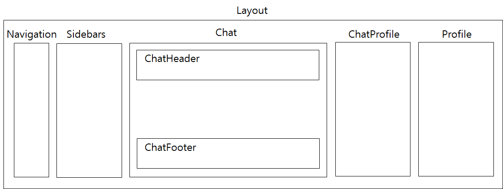

# hungry-chat-react

- 친구 및 친구가 아닌 사람들과 채팅하는 프로그램의 Front-end

## 1. Environment (실행환경)

- Java : 8~14 version
    - Java 16은 module 설치가 안됨
- Browser : Chrome, Opera, Edge

## 2. 실행 방법

```powershell
# 설치 (의존 모듈 설치)
npm i

# 실행
npm start
```

## 3. Architecture

```text
hungry-chat-react
   |--- /node modules                           [의존 모듈]
   |--- /public                                 [logo, index.html 등 정적 자원]
   |--- /src                         
          |---index.js                          [store 연결(redux)]
          |---App.js                            [route pages : sign-in, chat, ...]
          |---/assets                           [image, BGM, scss]
          |---/config                           [설정 정보 : socket 주소, node 및 spring 주소,...]
          |---/Store                            [Redux]
          |      |---/Actions                   [action 생성 함수; 상태 변경 이르키는 이벤트의 정적인 정보 객체의 모음]
          |      |---/Reducers                  [action과 state를 전달받아 새로운 state만드는 함수]
          |      |---index.js                   [reducer 모으고, reducer 사용하기 쉬운 이름 매칭 장소]
          |---/Pages                            [sign-up, chat, 아이디찾기 등의 페이지]
          |---/App                              [주요 페이지인 chat page내 component]
                 |---Layout.js                  [chat page 큰 틀]
                 |---Navigation.js              [logo등 navigation 저장]
                 |---/Partials                  [chat 화면]
                 |      |---Chat.js             [chat list; 채팅 스크롤 코드 위치]
                 |      |---ChatFooter.js       [message 보내기]
                 |      |---ChatHeader.js       [채팅방 정보]
                 |---/Sidebars                  [사이드 바 메뉴]
                 |      |---index.js            [(socket: user의 사이트 접속시 생성, 사이트 나가면 소멸) 현재 참여한 채팅방 리스트, 친구 리스트 및 오픈 채팅방 리스트 불러옴, 비회원의 기능 제한 부분 존재]
                 |      |---ChatProfile.js      [채팅방 정보 : 방 종류, 방 인원 수 등]
                 |      |---Profile.js          [친구 프로필 정보 : 이름, 프로필 사진 등]
                 |      |---/Chats              [(socket: participant의 채팅방 접속시 생성, 딴 채팅방 선택하거나 채팅방 나가면 소멸) 현재 참여한 채팅방 리스트(1:1 개인방, 그룹방, 오픈채팅방 포함) 중 선택된 채팅방에 대한 처리]
                 |      |---/OpenChats          [오픈채팅방 정보]
                 |      |---/Friends            [친구 리스트 (팔로워; 나를 추가한 사람 목록, 팔로우; 내가 추가한 사람 목록)]
                 |---/Modals                    [modal 모음]
                 |---/Module                    [중복 사용이 잦은 코드 모음]
                        |---FetchApi.js         [API 사용: node 와 연결]
                        |---chatForm.js         [채팅메세지 리스트 및 채팅 메세지 형식 forming]
                        |---roleStyle.js        [비회원인 경우 비활성화 기능 코드]
                        |---socket.js           [socket 연결 정보]
```

- 주요 페이지 (chat page) component 배치도
    
    
    

## 4. 기능

- 로그인 (회원 / 비회원)
- 회원가입
- 아이디 찾기 / 비밀번호 재설정 / (탈퇴한 회원 경우) 회원 활성화
- 프로필 : 프로필 사진, 이름, 전화번호 등 개인 정보
- 설정 : 프로필 사진 / 닉네임 / 비밀번호 / 상태 메세지 변경 , 회원 탈퇴
- 친구 추가/제거
    - 팔로우 : 내가 추가한 친구 목록
    - 팔로워 : 나를 친구추가한 사람들 목록
- BGM
- 채팅 방 생성 & 삭제
    - 그룹 채팅
    - 1:1 개인 채팅
    - 오픈채팅방
        - 비밀 방
- 오픈 채팅 && 채팅
    - 비회원 전용 공식 채팅방(official)
    - 스크롤 : 채팅 리스트 불러오기
    - 채팅 검색
    - 채팅 전송
        - 사진 전송 & 다운로드
        - 비디오 전송 & 다운로드
        - 코드 에디터
        - 코드 블럭(마크다운)
        - 이모티콘
    - 캘린더
        - 일정 추가
        - 일정 공유
    - 채팅방 정보
        - 채팅방 인원 수
        - 채팅방 참여 사람 리스트
        - 보낸 이미지 리스트
- 로그아웃

## 결과물

## 이슈사항

* [socket 중복 생성 문제 해결](https://velog.io/@mong-head/React-Socket-%EC%9D%B4%EB%B2%A4%ED%8A%B8-%EC%A4%91%EB%B3%B5-%ED%98%B8%EC%B6%9C-%EB%B0%A9%EC%A7%80)


